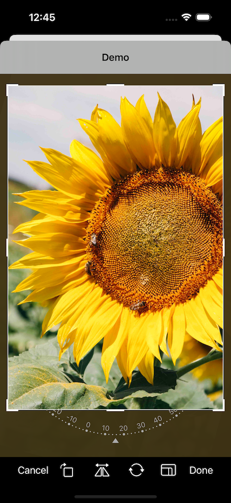
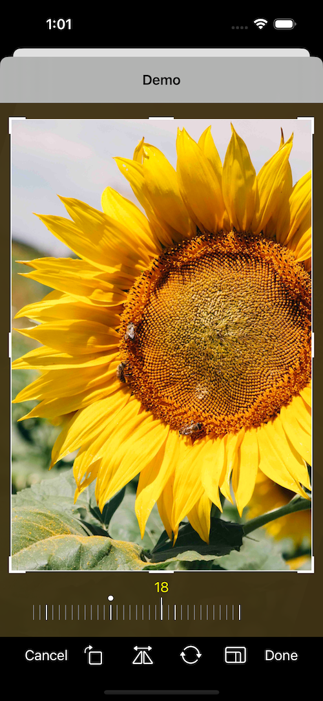

<p align="center">
    
</p>

<p align="center">
    
    
       
</p>

# Mantis

   Mantis is an iOS Image cropping library, which mimics the Photo App written in Swift and provides rich cropping interactions for your iOS/Mac app (Catalyst only).

<p align="center">
    
    
</p>

### 🆕 What's New

#### Perspective Correction (Skew)

Mantis now supports **Apple Photos–style perspective correction**, allowing users to adjust horizontal and vertical skew in addition to straightening. When enabled, the slide dial displays three circular icon buttons — **Straighten**, **Vertical**, and **Horizontal** — letting users switch between adjustment modes with a single tap.

- Real-time 3D perspective preview powered by `CATransform3D`
- Accurate image export using `CIPerspectiveCorrection`
- Full integration with existing features: undo/redo, flip, 90° rotation, and preset transformations

#### Appearance Mode

Mantis now supports **light, dark, and system appearance modes**. By default Mantis uses a dark appearance (backward compatible). You can switch to a light theme or let it follow the system setting.

- `.forceDark` — Always dark (default)
- `.forceLight` — Always light, similar to Apple Photos in light mode
- `.system` — Follows the system light/dark mode setting

```swift
var config = Mantis.Config()
config.appearanceMode = .forceLight   // or .system
let cropViewController = Mantis.cropViewController(image: <Your Image>, config: config)
```

### Demos

<p align="center">
     
     
     
</p>
   
   Mantis also provides rich crop shapes from the basic circle/square to polygon to arbitrary paths(We even provide a heart shape ❤️ 😏).
<p align="center">
    
</p>

## Requirements
* iOS 12.0+
* MacOS 10.15+
* Xcode 10.0+

## Install

<details>
    <summary><strong>CocoaPods</strong></summary>

```ruby
pod 'Mantis', '~> 2.28.2'
```
</details>

<details>
 <summary><strong>Carthage</strong></summary>

```ruby
github "guoyingtao/Mantis"
```
</details>

<details>
 <summary><strong>Swift Packages</strong></summary>

* Repository: https://github.com/guoyingtao/Mantis.git
* Rules: Version - Exact - 2.28.2

</details>

## Usage

<details>
<summary><strong>Basic</strong></summary>

* Create a CropViewController from Mantis with default config

**You need set (cropViewController or its navigation controller).modalPresentationStyle = .fullscreen for iOS 13+ when the cropViewController is presented**

### UIKit

```Swift
    let cropViewController = Mantis.cropViewController(image: <Your Image>)
    cropViewController.delegate = self
    <Your ViewController>.present(cropViewController, animated: true)
```

### SwiftUI

* Create an ImageCropperView from Mantis with default config

```Swift
struct MyView: View {
    @State private var image: UIImage?
    @State private var transformation: Transformation?
    @State private var cropInfo: CropInfo?

    var body: some View {
        ImageCropperView(
            image: $image,
            transformation: $transformation,
            cropInfo: $cropInfo
        )
    }
}
```

> **Note:**  
> - To start a crop operation programmatically, use the existing `action` binding(for `ImageCropperView`):  
>   ```swift
>   action = .crop
>   ```
> - To receive the result of the crop (success or failure), use the new `onCropCompleted` callback.  
>   This is especially useful because cropping may not complete instantly in all cases, so relying on this callback ensures you update your UI only after the operation finishes.

* The caller needs to conform CropViewControllerDelegate
```swift
public protocol CropViewControllerDelegate: class {
    func cropViewControllerDidCrop(_ cropViewController: CropViewController, cropped: UIImage, transformation: Transformation, cropInfo: CropInfo)
    func cropViewControllerDidCancel(_ cropViewController: CropViewController, original: UIImage)
    
    // The implementation of the following functions are optional
    func cropViewControllerDidFailToCrop(_ cropViewController: CropViewController, original: UIImage)     
    func cropViewControllerDidBeginResize(_ cropViewController: CropViewController)
    func cropViewControllerDidEndResize(_ cropViewController: CropViewController, original: UIImage, cropInfo: CropInfo)    
}
```
</details>
    
<details>
<summary><strong>CropToolbar mode</strong></summary>

* CropToolbar has two modes:

  * normal mode

  In normal mode, you can use a set of standard CropViewController photo editing features with "Cancel" and "Done" buttons.
<p align="center">
    
</p>

```swift
let cropViewController = Mantis.cropViewController(image: <Your Image>)
```

  * embedded mode
  
  This mode does not include "Cancel" and "Done" buttons, so you can embed CropViewController into another view controller

<p align="center">
    
</p>

```swift
var config = Mantis.Config()
config.cropToolbarConfig.mode = .embedded
let cropViewController = Mantis.cropViewController(image: <Your Image>, config: config)
```

</details>

<details>
<summary><strong>Add your own ratio</strong></summary>

```swift
            // Add a custom ratio 1:2 for portrait orientation
            let config = Mantis.Config()
            config.addCustomRatio(byVerticalWidth: 1, andVerticalHeight: 2)            
            <Your Crop ViewController> = Mantis.cropViewController(image: <Your Image>, config: config)
            
            // Set the ratioOptions of the config if you don't want to keep all default ratios
            let config = Mantis.Config() 
            //config.ratioOptions = [.original, .square, .custom]
            config.ratioOptions = [.custom]
            config.addCustomRatio(byVerticalWidth: 1, andVerticalHeight: 2)            
            <Your Crop ViewController> = Mantis.cropViewController(image: <Your Image>, config: config)
```

* If you always want to use only one fixed ratio, set Mantis.Config.presetFixedRatioType = alwaysUsingOnePresetFixedRatio

```swift
    <Your Crop ViewController>.config.presetFixedRatioType = .alwaysUsingOnePresetFixedRatio(ratio: 16.0 / 9.0)
```

When choose alwaysUsingOnePresetFixedRatio, fixed-ratio setting button does not show.

* If you want to hide rotation control view, set Mantis.Config.cropViewConfig.showAttachedRotationControlView = false
* If you want to use ratio list instead of presenter, set Mantis.CropToolbarConfig.ratioCandidatesShowType = .alwaysShowRatioList

```swift
public enum RatioCandidatesShowType {
    case presentRatioList
    case alwaysShowRatioList
}
```

* If you build your custom toolbar you can add your own fixed ratio buttons
```swift
// set a custom fixed ratio
cropToolbarDelegate?.didSelectRatio(ratio: 9 / 16)
```
</details>

<details>
<summary><strong>Crop shapes</strong></summary>

* If you want to set different crop shape, set Mantis.Config.cropViewConfig.cropShapeType
```swift
public enum CropShapeType {
    case rect
    case square
    case ellipse
    case circle(maskOnly: Bool = false)
    case diamond(maskOnly: Bool = false)
    case heart(maskOnly: Bool = false)
    case polygon(sides: Int, offset: CGFloat = 0, maskOnly: Bool = false)
    case path(points: [CGPoint], maskOnly: Bool = false)
}
```
</details>

<details>
<summary><strong>Preset transformations</strong></summary>

* If you want to apply transformations when showing an image, set Mantis.Config.cropViewConfig.presetTransformationType
```swift
public enum PresetTransformationType {
    case none
    case presetInfo(info: Transformation)
    case presetNormalizedInfo(normalizedInfo: CGRect)
}
```
Please use the transformation information obtained previously from delegate method cropViewControllerDidCrop(_ cropViewController: CropViewController, cropped: UIImage, transformation: Transformation, , cropInfo: CropInfo).

</details>

<details>
<summary><strong>Undo/Redo Support</strong></summary>

* Mantis offers full support for Undo, Redo, Revert to Original in both iOS and Catalyst.

* If you want to add support for this feature, set Mantis.Config.enableUndoRedo = true

* Catalyst menus for this feature are localized.

</details>

<details>
<summary><strong>Perspective Correction (Skew) 🆕</strong></summary>

* Enable perspective correction to let users adjust horizontal and vertical skew, similar to the Apple Photos app.

```swift
var config = Mantis.Config()
config.cropViewConfig.enablePerspectiveCorrection = true
let cropViewController = Mantis.cropViewController(image: <Your Image>, config: config)
```

When `enablePerspectiveCorrection` is `true`, the slide dial is used by default (no need to set `builtInRotationControlViewType` explicitly) and automatically switches to `withTypeSelector` mode, showing three circular icon buttons (Straighten / Vertical / Horizontal) above the ruler. Users can tap each button to switch adjustment modes.

* The skew values are included in the `Transformation` and `CropInfo` returned by the delegate, so you can persist and restore them via `presetTransformationType`.

* You can optionally customize the appearance of the type selector buttons through `SlideDialConfig`:
  - `typeButtonSize` — diameter of each circular button (default: 48)
  - `typeButtonSpacing` — spacing between buttons (default: 16)
  - `activeColor` — color for the selected button ring and value text
  - `inactiveColor` — color for unselected buttons
  - `pointerColor` — color of the center pointer on the ruler
  - `skewLimitation` — maximum skew angle in degrees (default: 30)

</details>

<details>
<summary><strong>Appearance Mode 🆕</strong></summary>

* Set the appearance mode to control the overall look of the crop UI.

```swift
var config = Mantis.Config()
config.appearanceMode = .forceLight   // or .forceDark (default), .system
let cropViewController = Mantis.cropViewController(image: <Your Image>, config: config)
```

```swift
public enum AppearanceMode {
    /// Always use dark appearance (default, backward compatible)
    case forceDark
    /// Always use light appearance
    case forceLight
    /// Follow system light/dark mode setting
    case system
}
```

* `.forceDark` is the default, keeping the existing dark-themed behavior.
* `.forceLight` uses a light color scheme similar to Apple Photos in light mode.
* `.system` dynamically adapts to the user's system-wide light/dark mode setting.

The appearance mode affects all UI components including the toolbar, dimming overlay, rotation dial, type selector, and ratio item views.

</details>

<details>
    <summary><strong>Localization</strong></summary>
    
* UIKit project    
    Add more languages support to the Localizations section for Project Info tab 
    
<p align="center">
    
    <br>fig 1</br>
</p>
    
* SwiftUI project    
    Please check this [link](https://github.com/guoyingtao/Mantis/discussions/123#discussioncomment-1127611)

* Static frameworks
    If you use static frameworks in CocoaPods, you need to add the code below in order to find the correct resource bundle.
    
```
    Mantis.locateResourceBundle(by: Self.self)
```
  
* Custom localization tables and bundle
    
By default mantis will use built in localization tables to get string resources not every language is supported out of the box (see fig 1).
    
However if your app support multiple languages and those languages are not 'built in', then you can define your own strings table and localize them in the application target or framework. By doing so you'll need to configure Mantis localization.

**IMPORTANT!** Firstly you'll need to create strings file with these keys:

```
"Mantis.Done" = "";
"Mantis.Cancel" = "";
"Mantis.Reset" = "";
"Mantis.Original" = "";
"Mantis.Square" = "";
"Mantis.Straighten" = "";
"Mantis.Horizontal" = "";
"Mantis.Vertical" = "";
```
Then you'll need to configure Mantis:

```
let config = Mantis.Config()
config.localizationConfig.bundle = // a bundle where strings file is located
config.localizationConfig.tableName = // a localized strings file name within the bundle
```
  
</details>

<details>
    <summary><strong>Custom View Controller</strong></summary>

- If needed you can subclass `CropViewController`:

```swift
class CustomViewController: CropViewController {
    override func viewDidLoad() {
        super.viewDidLoad()

        // Do your custom logic here.
        // The MantisExample project also has a showcase for a CustomViewController.
    }
}
```

- To get an instance, Mantis provides a factory method:

```swift
let cropViewController: CustomViewController = Mantis.cropViewController(image: image, config: config)
```

</details>
    
### Demo projects
Mantis provide two demo projects
- MantisExample (using Storyboard)
- MantisSwiftUIExample (using SwiftUI)
  - Mantis provides an **out-of-the-box SwiftUI wrapper** named `ImageCropperView`,  
making it easy to integrate the image cropping interface directly in SwiftUI apps.

### Showcases

Below are apps that use the Mantis framework. If your app also uses Mantis and you’d like it to be showcased here, please submit a PR following the existing format.

| <a href="https://apps.apple.com/us/app/pictopoem/id6692614035"></a><br/>[**Pictopoem**](https://apps.apple.com/us/app/pictopoem/id6692614035)<br/>Where Images Whisper Poems | <a href="https://apps.apple.com/us/app/text-behind-me/id6736535053"></a><br/>[**Text Behind Me**](https://apps.apple.com/us/app/text-behind-me/id6736535053)<br/>Add Depth to Your Photos |
|---|---|

### Backers & Sponsors
Become a sponsor through [GitHub Sponsors](https://github.com/sponsors/guoyingtao). 

## Credits
* The crop feature is strongly inspired by [TOCropViewController](https://github.com/TimOliver/TOCropViewController) 
* The rotation feature is inspired by [IGRPhotoTweaks](https://github.com/IGRSoft/IGRPhotoTweaks)
* The rotation dial is inspired by [10clock](https://github.com/joedaniels29/10Clock)
* Thanks [Leo Dabus](https://stackoverflow.com/users/2303865/leo-dabus) for helping me to solve the problem of cropping an ellipse image with transparent background https://stackoverflow.com/a/59805317/288724
* <div>Icons made by <a href="https://www.freepik.com" title="Freepik">Freepik</a> from <a href="https://www.flaticon.com/" title="Flaticon">www.flaticon.com</a> is licensed by <a href="http://creativecommons.org/licenses/by/3.0/" title="Creative Commons BY 3.0" target="_blank">CC 3.0 BY</a></div>


