<p align="center">
    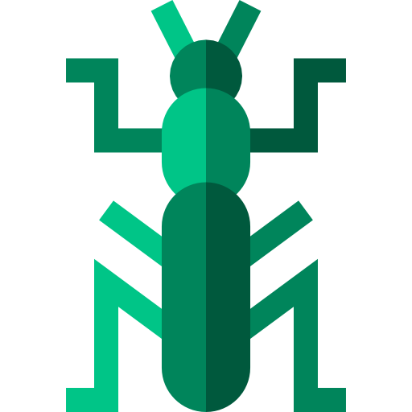
</p>

<p align="center">
    
    
       
</p>

# Mantis

   Mantis is a swift 5.0 library that mimics most interactions in the Photos.app on an iOS device. You can use the  CropViewController of Mantis with default buttons, or you can add your own buttons under the "customized" mode. 
   
<p align="center">
    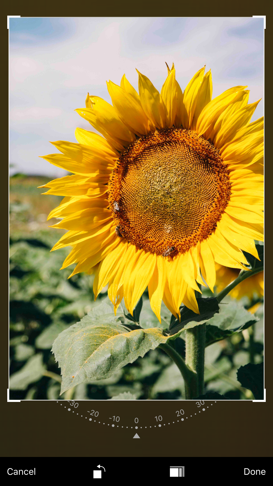
    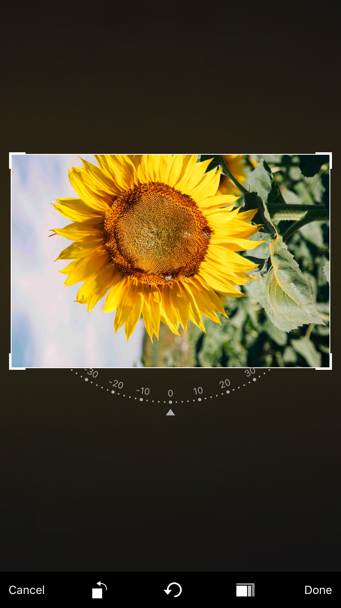
    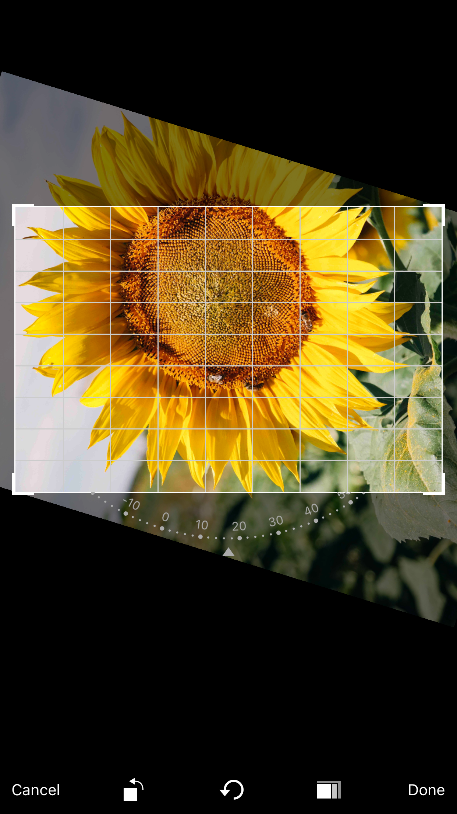
    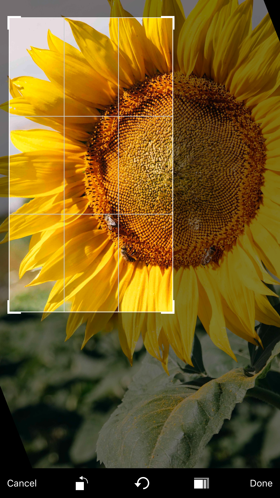
    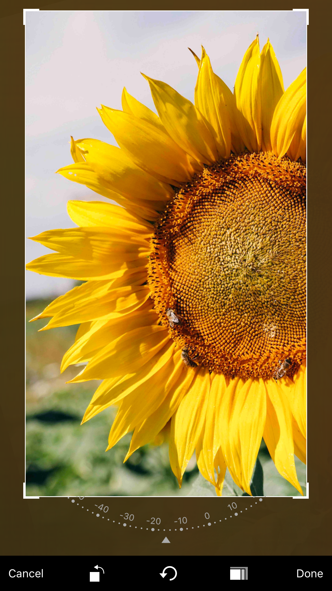
    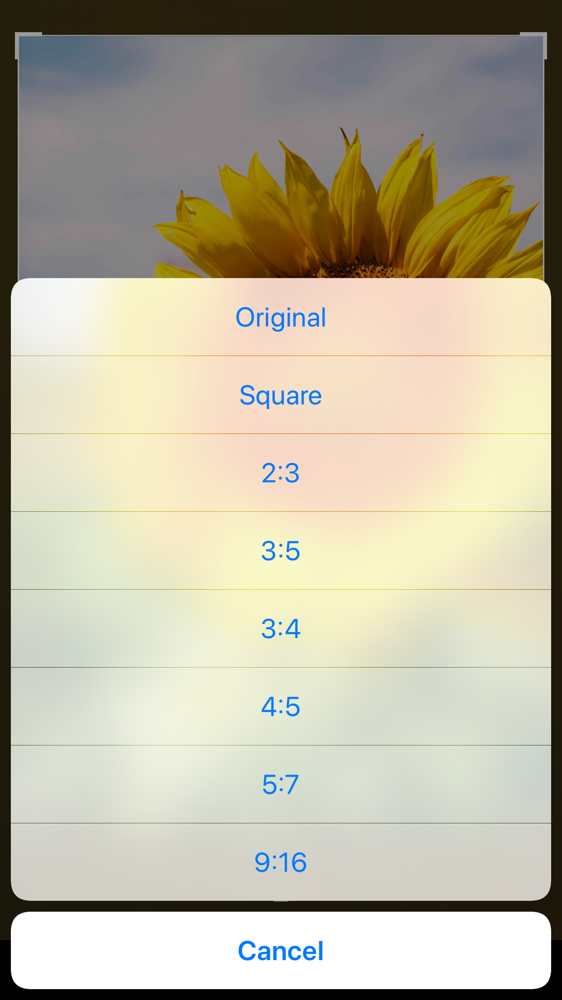
    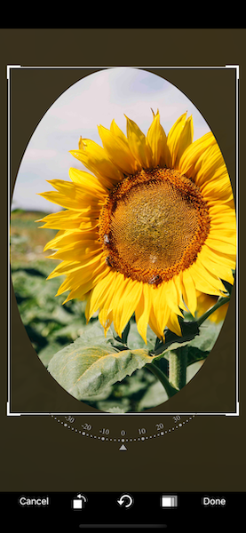
    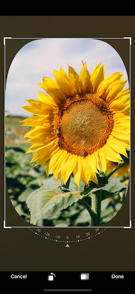
    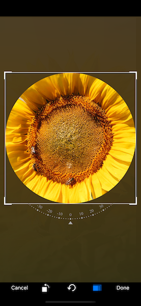
    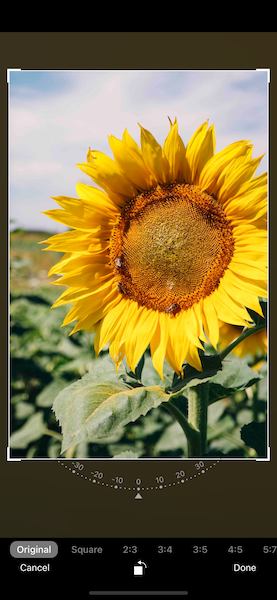
</p>

## Credits
The crop and rotation feature are strongly inspired by [TOCropViewController](https://github.com/TimOliver/TOCropViewController) and [IGRPhotoTweaks](https://github.com/IGRSoft/IGRPhotoTweaks).

The rotation dial is inspired by [10clock](https://github.com/joedaniels29/10Clock)

Thanks [Leo Dabus](https://stackoverflow.com/users/2303865/leo-dabus) for helping me to solve the problem of cropping an ellipse image with transparent background https://stackoverflow.com/a/59805317/288724

## Requirements
* iOS 11.0+
* Xcode 10.0+

## Install

### CocoaPods

```ruby
pod 'Mantis', '~> 1.4.13'
```

### Carthage

```ruby
github "guoyingtao/Mantis"
```

## Usage

**Mantis doesn't dismiss CropViewController anymore since 1.2.0. You need to dismiss it by yourself.**
**For CropViewControllerDelegate protocol, cropViewControllerDidCancel becomes non-optional, and cropViewControllerWillDismiss is deprecated**

* Create a cropViewController in Mantis with default config and default mode

**You need set (cropViewController or its navigation controller).modalPresentationStyle = .fullscreen for iOS 13 when the cropViewController is presented**

```swift
let cropViewController = Mantis.cropViewController(image: <Your Image>)
```

* The caller needs to conform CropViewControllerDelegate
```swift
public protocol CropViewControllerDelegate: class {
    func cropViewControllerDidCrop(_ cropViewController: CropViewController, cropped: UIImage, transformation: Transformation)
    func cropViewControllerDidFailToCrop(_ cropViewController: CropViewController, original: UIImage) // optional
    func cropViewControllerDidCancel(_ cropViewController: CropViewController, original: UIImage)
}
```

* CropViewController has two modes:

  * normal mode

  In normal mode, you can use a set of standard CropViewController photo editing features.
<p align="center">
    
</p>

```swift
let cropViewController = Mantis.cropViewController(image: <Your Image>)
```

  * customizable mode
  
  This mode includes the standard cropping feature, while enabling users to customize other edit features.

<p align="center">
    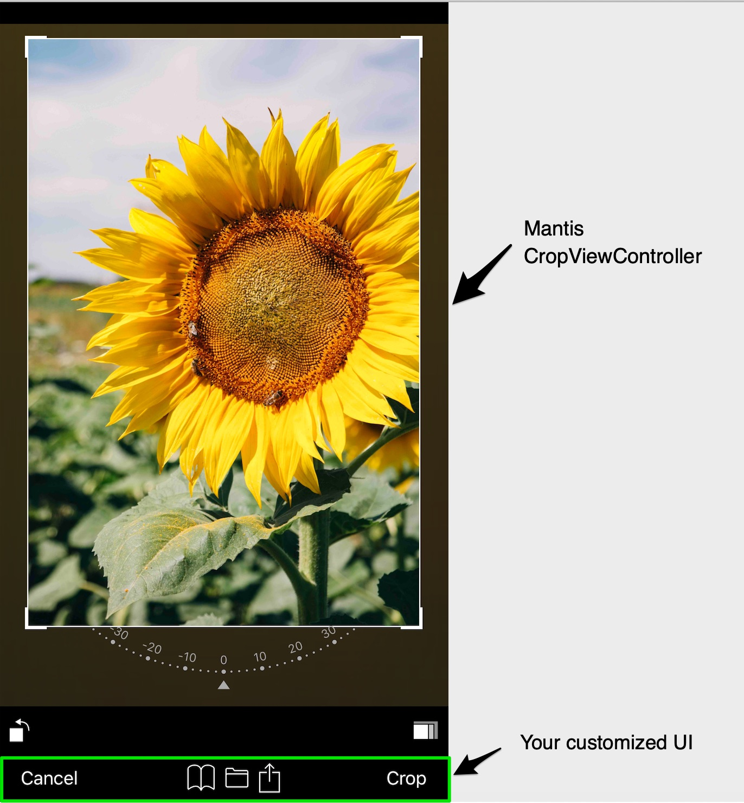
</p>

```swift
let cropViewController = Mantis.cropCustomizableViewController(image: <Your Image>)
```

* Add your own ratio
```swift
            // Add a custom ratio 1:2 for portrait orientation
            let config = Mantis.Config()
            config.addCustomRatio(byVerticalWidth: 1, andVerticalHeight: 2)            
            <Your Crop ViewController> = Mantis.cropViewController(image: <Your Image>, config: config)
            
            // Set the ratioOptions of the config if you don't want to keep all default ratios
            let config = Mantis.Config() 
            //config.ratioOptions = [.original, .square, .custom]
            config.ratioOptions = [.custom]
            config.addCustomRatio(byVerticalWidth: 1, andVerticalHeight: 2)            
            <Your Crop ViewController> = Mantis.cropViewController(image: <Your Image>, config: config)
```

* If you always want to use only one fixed ratio, set Mantis.Config.presetFixedRatioType = alwaysUsingOnePresetFixedRatio

```swift
    <Your Crop ViewController>.config.presetFixedRatioType = .alwaysUsingOnePresetFixedRatio(ratio: 16.0 / 9.0)
```

When choose alwaysUsingOnePresetFixedRatio, fixed-ratio setting button does not show.

* If you want to hide rotation dial, set Mantis.Config.showRotationDial = false
* If you want to use ratio list instead of presenter, set Mantis.CropToolbarConfig.ratioCandidatesShowType = .alwaysShowRatioList

```swift
public enum RatioCandidatesShowType {
    case presentRatioList
    case alwaysShowRatioList
}
```

* If you build your custom toolbar you can add your own fixed ratio buttons
```swift
// set a custom fixed ratio
cropToolbarDelegate?.didSelectRatio(ratio: 9 / 16)
```


* If you want to set different crop shape, set Mantis.Config.cropShapeType
```swift
public enum CropShapeType {
    case rect
    case ellipse(maskOnly: Bool = false)
    case roundedRect(radiusToShortSide: CGFloat, maskOnly: Bool = false)
}
```

* If you want to apply transformations when showing an image, set Mantis.Config.presetTransformationType
```swift
public enum PresetTransformationType {
    case none
    case presetInfo(info: Transformation)
    case presetNormalizedInfo(normailizedInfo: CGRect)
}
```
Please use the transformation infomation obtained previously from delegate method cropViewControllerDidCrop(_ cropViewController: CropViewController, cropped: UIImage, transformation: Transformation).

<p align="center">
    
    
    
    
</p>

### Demo code

```swift
        let cropViewController = Mantis.cropViewController(image: <Your Image>)
        cropViewController.delegate = self
        <Your ViewController>.present(cropViewController, animated: true)
```

<div>Icons made by <a href="https://www.freepik.com" title="Freepik">Freepik</a> from <a href="https://www.flaticon.com/" title="Flaticon">www.flaticon.com</a> is licensed by <a href="http://creativecommons.org/licenses/by/3.0/" title="Creative Commons BY 3.0" target="_blank">CC 3.0 BY</a></div>


