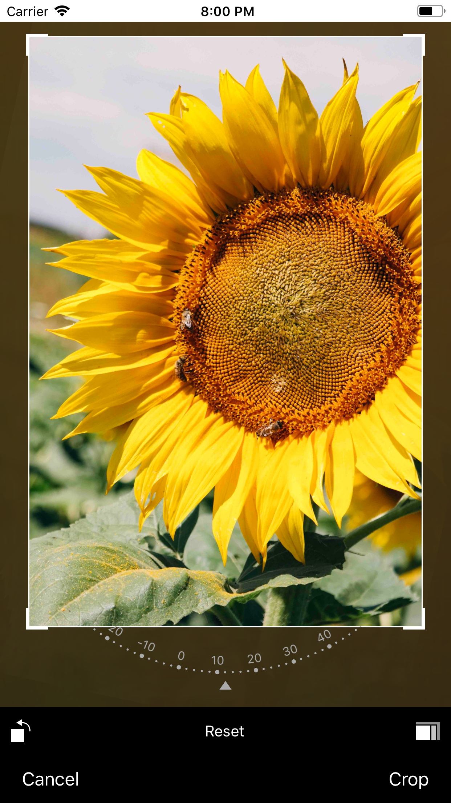

<p align="center">
    
</p>

<p align="center">
    
    
       
</p>

# Mantis

   Mantis is a swift 4.2 library that mimics almost most interactions of Photos.app of iOS device. You can use CropViewController of Mantis with default buttons or you can also add your own buttons under "customized" mode. 
This project is strongly inspired by [IGRPhotoTweaks](https://github.com/IGRSoft/IGRPhotoTweaks) and [TOCropViewController](https://github.com/TimOliver/TOCropViewController).

<p align="center">
    
    
    
    
    
    
</p>

## Install

### CocoaPods

To do

## Usage

* Create a crop ViewController of Mantis

```swift
let cropViewController = Mantis.cropViewController(image: <Your Image>, mode: .normal)
```

* The caller need to conform CropViewControllerProtocal
```swift
public protocol CropViewControllerProtocal: class {
    func didGetCroppedImage(image: UIImage)
}
```

* CropViewController has two modes

  * normal mode

  Under this mode, you can use CropViewController as normal one.
<p align="center">
    
</p>

  
  * embedded mode
  
  Under this mode, you can embed CropViewController into another UIViewController. That way you can add more customized edit features other than cropping.

<p align="center">
    
</p>

### Demo code

```swift
        let cropViewController = Mantis.cropViewController(image: <Your Image>, mode: .normal)
        cropViewController.delegate = self
        <Your ViewController>.present(cropViewController, animated: true)
```

<div>Icons made by <a href="https://www.freepik.com" title="Freepik">Freepik</a> from <a href="https://www.flaticon.com/" title="Flaticon">www.flaticon.com</a> is licensed by <a href="http://creativecommons.org/licenses/by/3.0/" title="Creative Commons BY 3.0" target="_blank">CC 3.0 BY</a></div>


