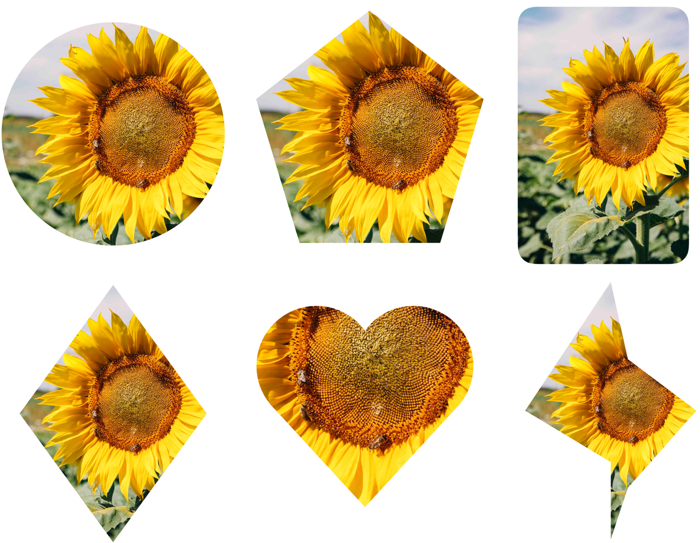

<p align="center">
    
</p>

<p align="center">
    
    
       
</p>

# Mantis

   Mantis is an open-source swift library that provides rich cropping interactions for your iOS/Mac app.
   
<p align="center">
    
</p>
   
   Mantis also provide rich crop shapes from basic cicle to polygon to arbitrary paths.
<p align="center">
    
</p>


## Requirements
* iOS 11.0+
* MacOS 10.15+
* Xcode 10.0+

## Install

<details>
    <summary><strong>CocoaPods</strong></summary>

```ruby
pod 'Mantis', '~> 1.7.1'
```
</details>

<details>
 <summary><strong>Carthage</strong></summary>

```ruby
github "guoyingtao/Mantis"
```
</details>

<details>
 <summary><strong>Swift Packages</strong></summary>

* Respository: https://github.com/guoyingtao/Mantis.git
* Rules: Version - Exact - 1.6.2

</details>

## Usage

<details>
<summary><strong>Basic</strong></summary>

* Create a cropViewController in Mantis with default config and default mode

**You need set (cropViewController or its navigation controller).modalPresentationStyle = .fullscreen for iOS 13+ when the cropViewController is presented**

```Swift
    let cropViewController = Mantis.cropViewController(image: <Your Image>)
    cropViewController.delegate = self
    <Your ViewController>.present(cropViewController, animated: true)
```

* The caller needs to conform CropViewControllerDelegate
```swift
public protocol CropViewControllerDelegate: class {
    func cropViewControllerDidCrop(_ cropViewController: CropViewController, cropped: UIImage, transformation: Transformation)
    func cropViewControllerDidCancel(_ cropViewController: CropViewController, original: UIImage)
    
    // The implementaion of the following functions are optional
    func cropViewControllerDidFailToCrop(_ cropViewController: CropViewController, original: UIImage)     
    func cropViewControllerDidBeginResize(_ cropViewController: CropViewController)
    func cropViewControllerDidEndResize(_ cropViewController: CropViewController, original: UIImage, cropInfo: CropInfo)    
}
```
</details>
    
<details>
<summary><strong>UI mode</strong></summary>

* CropViewController has two modes:

  * normal mode

  In normal mode, you can use a set of standard CropViewController photo editing features.
<p align="center">
    
</p>

```swift
let cropViewController = Mantis.cropViewController(image: <Your Image>)
```

  * customizable mode
  
  This mode includes the standard cropping feature, while enabling users to customize other edit features.

<p align="center">
    
</p>

```swift
let cropViewController = Mantis.cropCustomizableViewController(image: <Your Image>)
```

</details>

<details>
<summary><strong>Add your own ratio</strong></summary>

```swift
            // Add a custom ratio 1:2 for portrait orientation
            let config = Mantis.Config()
            config.addCustomRatio(byVerticalWidth: 1, andVerticalHeight: 2)            
            <Your Crop ViewController> = Mantis.cropViewController(image: <Your Image>, config: config)
            
            // Set the ratioOptions of the config if you don't want to keep all default ratios
            let config = Mantis.Config() 
            //config.ratioOptions = [.original, .square, .custom]
            config.ratioOptions = [.custom]
            config.addCustomRatio(byVerticalWidth: 1, andVerticalHeight: 2)            
            <Your Crop ViewController> = Mantis.cropViewController(image: <Your Image>, config: config)
```

* If you always want to use only one fixed ratio, set Mantis.Config.presetFixedRatioType = alwaysUsingOnePresetFixedRatio

```swift
    <Your Crop ViewController>.config.presetFixedRatioType = .alwaysUsingOnePresetFixedRatio(ratio: 16.0 / 9.0)
```

When choose alwaysUsingOnePresetFixedRatio, fixed-ratio setting button does not show.

* If you want to hide rotation dial, set Mantis.Config.showRotationDial = false
* If you want to use ratio list instead of presenter, set Mantis.CropToolbarConfig.ratioCandidatesShowType = .alwaysShowRatioList

```swift
public enum RatioCandidatesShowType {
    case presentRatioList
    case alwaysShowRatioList
}
```

* If you build your custom toolbar you can add your own fixed ratio buttons
```swift
// set a custom fixed ratio
cropToolbarDelegate?.didSelectRatio(ratio: 9 / 16)
```
</details>

<details>
<summary><strong>Crop shapes</strong></summary>

* If you want to set different crop shape, set Mantis.Config.cropShapeType
```swift
public enum CropShapeType {
    case rect
    case square
    case ellipse
    case circle(maskOnly: Bool = false)
    case diamond(maskOnly: Bool = false)
    case heart(maskOnly: Bool = false)
    case polygon(sides: Int, offset: CGFloat = 0, maskOnly: Bool = false)
    case path(points: [CGPoint], maskOnly: Bool = false)
}
```
</details>

<details>
<summary><strong>Preset transformations</strong></summary>

* If you want to apply transformations when showing an image, set Mantis.Config.presetTransformationType
```swift
public enum PresetTransformationType {
    case none
    case presetInfo(info: Transformation)
    case presetNormalizedInfo(normailizedInfo: CGRect)
}
```
Please use the transformation infomation obtained previously from delegate method cropViewControllerDidCrop(_ cropViewController: CropViewController, cropped: UIImage, transformation: Transformation).

</details>
    
### Demo projects
Mantis provide two demo projects
- MantisExample (using Storyboard)
- MantisSwiftUIExample (using SwiftUI)

## Credits
* The crop are strongly inspired by [TOCropViewController](https://github.com/TimOliver/TOCropViewController) 
* The rotation feature is inspired by [IGRPhotoTweaks](https://github.com/IGRSoft/IGRPhotoTweaks)
* The rotation dial is inspired by [10clock](https://github.com/joedaniels29/10Clock)
* Thanks [Leo Dabus](https://stackoverflow.com/users/2303865/leo-dabus) for helping me to solve the problem of cropping an ellipse image with transparent background https://stackoverflow.com/a/59805317/288724
* <div>Icons made by <a href="https://www.freepik.com" title="Freepik">Freepik</a> from <a href="https://www.flaticon.com/" title="Flaticon">www.flaticon.com</a> is licensed by <a href="http://creativecommons.org/licenses/by/3.0/" title="Creative Commons BY 3.0" target="_blank">CC 3.0 BY</a></div>


