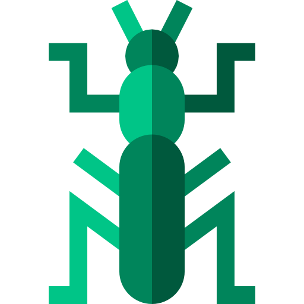
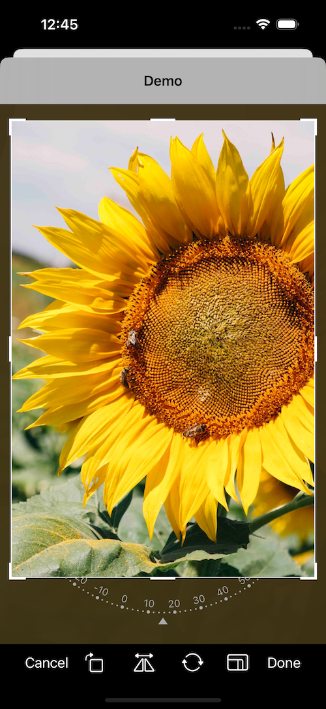
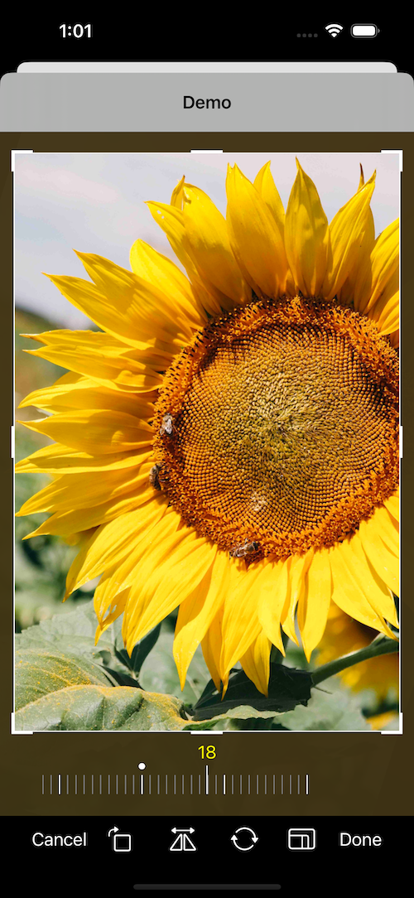
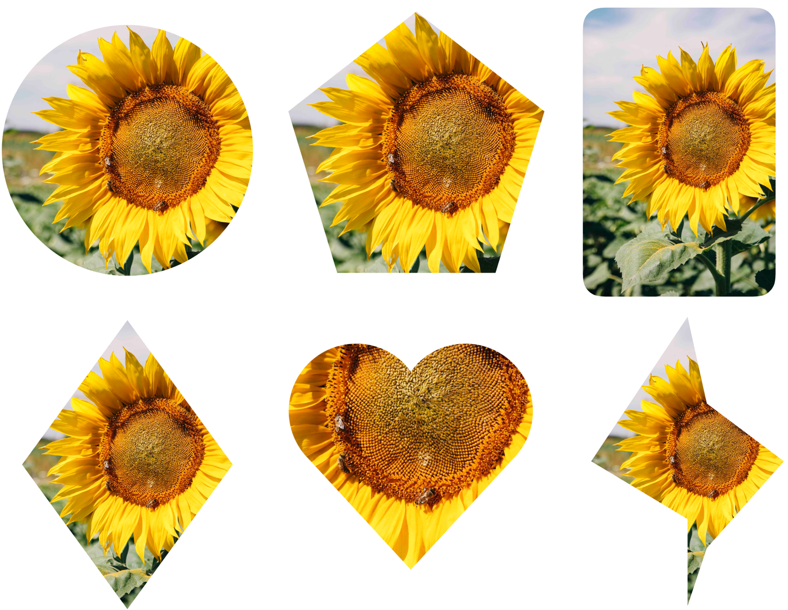
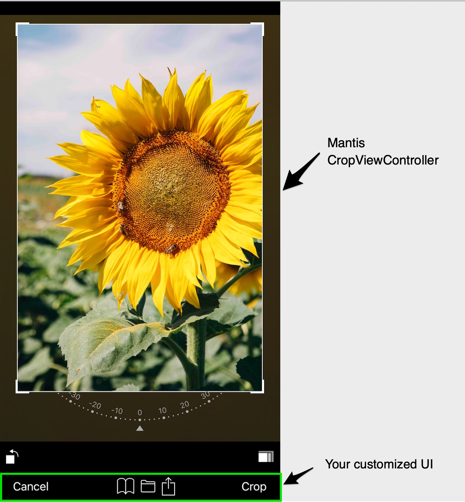

<p align="center">
    
</p>

<p align="center">
    
    
    
    
    
    
</p>

# Mantis — Image Cropping Library for iOS (Swift · UIKit · SwiftUI)

Mantis is an open-source **iOS image cropping library** written in Swift, with both **UIKit** and **SwiftUI** APIs. It gives your app an Apple Photos–style photo crop and edit experience: crop with **rotation**, **flip**, free or **fixed aspect ratios**, rich **crop shapes** (circle, ellipse, rounded rectangle, polygon, heart, arbitrary paths), **perspective correction (skew)**, and full **undo/redo** — on iOS and Mac Catalyst.

<p align="center">
    
    
    
</p>

## Features

- ✂️ **Photos-app-style cropping UI** — pan, zoom, resize the crop box, rotate 90°, flip, and straighten with a rotation dial or slide dial
- 🖼 **Free or fixed aspect ratios** — built-in presets (original, square, 16:9, …) plus your own custom ratios
- 🟣 **Rich crop shapes** — rectangle, square, circle, ellipse, rounded rectangle, diamond, polygon, heart, or any custom path (with optional mask-only mode)
- 📐 **Perspective correction (skew)** — Apple Photos–style vertical/horizontal perspective adjustment with real-time 3D preview
- ↩️ **Undo / Redo / Revert to original** — independent history per cropper, with localized Mac Catalyst menus
- 🧩 **Two SwiftUI APIs** — a modern declarative `ImageCropper` view with modifiers and an observable `CropSession`, plus a binding-based `ImageCropperView`
- 💾 **Persist and restore crops** — `CropInfo` is `Codable` (3.1+); re-crop the original image offline in a later session, or reopen the editor at the saved state
- 🌗 **Light / dark / system appearance modes**
- 🌍 **Localized into 14+ languages** (Arabic, Chinese, English, French, German, Italian, Japanese, Korean, Dutch, Portuguese, Russian, Spanish, Turkish, …) with custom localization support
- 🧱 **Highly customizable** — embed the cropper in your own view controller, build a custom toolbar, subclass `CropViewController`, tweak colors, borders, dial styles, and more
- 🐘 **Large-image support** — async crop mode and pixel-count limiting for very large photos
- 🔒 **Privacy manifest included** (`PrivacyInfo.xcprivacy`)

## Demos

<div align="center">
  <video 
    src="https://github.com/user-attachments/assets/732f0aab-21ab-4980-890f-4640432dec27"
    controls
    width="720">
  </video>
</div>

<p align="center">
     
     
    
</p>

Mantis provides rich crop shapes, from basic circle/square to polygons to arbitrary paths (we even provide a heart shape ❤️ 😏).

<p align="center">
    
</p>

## Table of Contents

- [Quick Start](#quick-start)
- [Requirements](#requirements)
- [Installation](#installation)
- [What's New in Mantis 3.x](#whats-new-in-mantis-3x)
- [Usage](#usage)
- [Migrating from 2.x](#migrating-from-2x)
- [Demo Projects](#demo-projects)
- [FAQ](#faq)
- [Apps Using Mantis](#apps-using-mantis)
- [Credits](#credits)
- [License](#license)

## Quick Start

### SwiftUI

```swift
import Mantis
import SwiftUI

struct AvatarCropView: View {
    let image: UIImage
    @State private var croppedImage: UIImage?

    var body: some View {
        ImageCropper(image: image)
            .cropShape(.circle)
            .aspectRatio(.fixed(1))
            .onCrop { result in
                croppedImage = result.croppedImage
            }
    }
}
```

### UIKit

```swift
import Mantis

let cropViewController = Mantis.cropViewController(image: yourImage)
cropViewController.delegate = self
cropViewController.modalPresentationStyle = .fullScreen // required when presenting
present(cropViewController, animated: true)

// Receive the result:
extension YourViewController: CropViewControllerDelegate {
    func cropViewControllerDidCrop(_ cropViewController: CropViewController,
                                   cropped: UIImage,
                                   transformation: Transformation,
                                   cropInfo: CropInfo) {
        // Use the cropped image
    }

    func cropViewControllerDidCancel(_ cropViewController: CropViewController,
                                     original: UIImage) {
        // Handle cancel
    }
}
```

See [Usage](#usage) below for aspect ratios, crop shapes, undo/redo, persistence, and full customization.

## Requirements

- iOS 15.0+
- macOS 12.0+ (Mac Catalyst)
- Xcode 13.0+ (Xcode 15+ recommended — enables the iOS 17 Observation-based fine-grained tracking in `CropSession`)

## Installation

### Swift Package Manager (recommended)

In Xcode: **File → Add Package Dependencies…** and enter:

```
https://github.com/guoyingtao/Mantis.git
```

Rule: **Version — Up to Next Major — 3.1.0**

Or in `Package.swift`:

```swift
.package(url: "https://github.com/guoyingtao/Mantis.git", from: "3.1.0")
```

### CocoaPods

```ruby
pod 'Mantis', '~> 3.1.0'
```

### Carthage

```ruby
github "guoyingtao/Mantis"
```

## What's New in Mantis 3.x

For the complete history see the [CHANGELOG](CHANGELOG.md).

### Declarative SwiftUI API (3.0)

Mantis 3.0 introduced a modern, declarative SwiftUI API:

- **`ImageCropper`** — a SwiftUI view configured with modifiers:

```swift
ImageCropper(image: myImage)
    .cropShape(.circle)
    .aspectRatio(.fixed(16/9))
    .onCrop { result in croppedImage = result.croppedImage }
```

- **`CropSession`** — an observable handle to a live crop session. It exposes `canUndo`, `canRedo`, `isResettable` and the live `transformation` as observable state, and drives the cropper with plain methods (`rotate()`, `flip()`, `crop()`, `undo()`, `redo()`, `reset()`, `setAspectRatio()`) instead of the old enum-binding action pattern. On iOS 17+ it participates in the Observation framework for fine-grained, per-property updates; on iOS 15/16 it behaves as a plain `ObservableObject`.
- **Independent undo history per cropper** — the internal transform stack is no longer a global singleton, so two croppers shown at the same time (e.g. iPad multi-window) keep separate undo/redo histories.

The binding-based `ImageCropperView` API remains fully supported. See the [SwiftUI usage section](#usage) for the full API and the MantisSwiftUIExample project for working demos.

### Codable crop persistence (3.1)

`CropInfo` now conforms to `Codable`, so you can save a user's exact crop and reproduce it offline in a later app session — including rotated, fixed-ratio, perspective-skewed, and large-image crops. See [Persisting and restoring crops](#usage).

### Perspective correction (skew)

Mantis supports **Apple Photos–style perspective correction**, letting users adjust horizontal and vertical skew in addition to straightening. When enabled, the slide dial displays three circular icon buttons — **Straighten**, **Vertical**, and **Horizontal** — so users can switch adjustment modes with a single tap.

- Real-time 3D perspective preview powered by `CATransform3D`
- Accurate image export using `CIPerspectiveCorrection`
- Full integration with existing features: undo/redo, flip, 90° rotation, and preset transformations

### Appearance mode

Mantis supports **light, dark, and system appearance modes**. By default Mantis uses a dark appearance (backward compatible).

```swift
var config = Mantis.Config()
config.appearanceMode = .forceLight   // or .forceDark (default), .system
let cropViewController = Mantis.cropViewController(image: yourImage, config: config)
```

## Usage

<details>
<summary><strong>Basic</strong></summary>

> **Important:** set `modalPresentationStyle = .fullScreen` on the crop view controller (or its navigation controller) when presenting it.

### UIKit

```swift
let cropViewController = Mantis.cropViewController(image: yourImage)
cropViewController.delegate = self
cropViewController.modalPresentationStyle = .fullScreen
present(cropViewController, animated: true)
```

The caller conforms to `CropViewControllerDelegate`:

```swift
public protocol CropViewControllerDelegate: AnyObject {
    func cropViewControllerDidCrop(_ cropViewController: CropViewController, cropped: UIImage, transformation: Transformation, cropInfo: CropInfo)
    func cropViewControllerDidCancel(_ cropViewController: CropViewController, original: UIImage)
    
    // The implementation of the following functions are optional
    func cropViewControllerDidFailToCrop(_ cropViewController: CropViewController, original: UIImage)     
    func cropViewControllerDidBeginResize(_ cropViewController: CropViewController)
    func cropViewControllerDidEndResize(_ cropViewController: CropViewController, original: UIImage, cropInfo: CropInfo)    
}
```

### SwiftUI

#### Declarative API (Mantis 3.0+)

`ImageCropper` is a declarative SwiftUI view configured with modifiers:

```swift
struct MyView: View {
    @State private var croppedImage: UIImage?

    var body: some View {
        ImageCropper(image: myImage)
            .cropShape(.circle)
            .aspectRatio(.fixed(16/9))
            .onCrop { result in
                croppedImage = result.croppedImage
            }
    }
}
```

To build your own controls, attach a `CropSession`. It exposes `canUndo`, `canRedo`,
`isResettable` and the live `transformation` as observable state (fine-grained
`Observation` tracking on iOS 17+, `ObservableObject` on iOS 15/16), and drives the
cropper with plain methods instead of enum bindings:

```swift
struct MyCropperView: View {
    @StateObject private var session = CropSession()
    @State private var croppedImage: UIImage?

    var body: some View {
        VStack {
            ImageCropper(image: myImage, session: session)
                .builtInToolbarVisible(false)
                .onCrop { result in croppedImage = result.croppedImage }

            HStack {
                Button("Undo") { session.undo() }
                    .disabled(!session.canUndo)
                Button("Redo") { session.redo() }
                    .disabled(!session.canRedo)
                Button("Reset") { session.reset() }
                    .disabled(!session.isResettable)
                Button("Rotate") { session.rotate(.clockwise) }
                Button("Flip") { session.flip(.horizontal) }
                Button("Done") { session.crop() }
            }
        }
    }
}
```

Available modifiers: `.cropShape(_:)`, `.aspectRatio(_:)`, `.builtInToolbarVisible(_:)`,
`.appearance(_:)`, `.configure { $0... }` (escape hatch to the full `Mantis.Config`),
`.onCrop(_:)`, `.onCancel(_:)`, `.onCropFailed(_:)`.

#### Binding-based API

Kept for backward compatibility and fully supported; new code should prefer the declarative `ImageCropper` above.

```swift
struct MyView: View {
    @State private var image: UIImage?
    @State private var transformation: Transformation?
    @State private var cropInfo: CropInfo?

    var body: some View {
        ImageCropperView(
            image: $image,
            transformation: $transformation,
            cropInfo: $cropInfo
        )
    }
}
```

> **Note:**  
> - To start a crop operation programmatically, use the `action` binding (for `ImageCropperView`):  
>   ```swift
>   action = .crop
>   ```
> - To receive the result of the crop (success or failure), use the `onCropCompleted` callback.  
>   This is especially useful because cropping may not complete instantly in all cases, so relying on this callback ensures you update your UI only after the operation finishes.

</details>
    
<details>
<summary><strong>CropToolbar mode</strong></summary>

CropToolbar has two modes:

* **normal mode**

  In normal mode, you can use a set of standard CropViewController photo editing features with "Cancel" and "Done" buttons.

<p align="center">
    
</p>

```swift
let cropViewController = Mantis.cropViewController(image: yourImage)
```

* **embedded mode**
  
  This mode does not include "Cancel" and "Done" buttons, so you can embed CropViewController into another view controller and build your own surrounding UI.

<p align="center">
    
</p>

```swift
var config = Mantis.Config()
config.cropToolbarConfig.mode = .embedded
let cropViewController = Mantis.cropViewController(image: yourImage, config: config)
```

</details>

<details>
<summary><strong>Custom aspect ratios</strong></summary>

```swift
// Add a custom ratio 1:2 for portrait orientation
var config = Mantis.Config()
config.addCustomRatio(byVerticalWidth: 1, andVerticalHeight: 2)            
let cropViewController = Mantis.cropViewController(image: yourImage, config: config)

// Set the ratioOptions of the config if you don't want to keep all default ratios
var config = Mantis.Config() 
//config.ratioOptions = [.original, .square, .custom]
config.ratioOptions = [.custom]
config.addCustomRatio(byVerticalWidth: 1, andVerticalHeight: 2)            
let cropViewController = Mantis.cropViewController(image: yourImage, config: config)
```

* If you always want to use only one fixed ratio, set `presetFixedRatioType` to `alwaysUsingOnePresetFixedRatio`:

```swift
config.presetFixedRatioType = .alwaysUsingOnePresetFixedRatio(ratio: 16.0 / 9.0)
```

When choosing `alwaysUsingOnePresetFixedRatio`, the fixed-ratio setting button does not show. (In the declarative SwiftUI API this is `.aspectRatio(.fixed(16/9))`.)

* If you want to hide the rotation control view, set `config.cropViewConfig.showAttachedRotationControlView = false`
* If you want to use a ratio list instead of a presenter, set `config.cropToolbarConfig.ratioCandidatesShowType = .alwaysShowRatioList`

```swift
public enum RatioCandidatesShowType {
    case presentRatioList
    case alwaysShowRatioList
}
```

* If you build your own custom toolbar you can add your own fixed ratio buttons:

```swift
// set a custom fixed ratio
cropToolbarDelegate?.didSelectRatio(ratio: 9 / 16)
```
</details>

<details>
<summary><strong>Crop shapes (circle, polygon, heart, custom path …)</strong></summary>

To use a different crop shape — for example a **circular avatar crop** — set `config.cropViewConfig.cropShapeType`:

```swift
public enum CropShapeType {
    case rect
    case square
    case ellipse(maskOnly: Bool = false)
    case circle(maskOnly: Bool = false)
    case roundedRect(radiusToShortSide: CGFloat, maskOnly: Bool = false)
    case diamond(maskOnly: Bool = false)
    case heart(maskOnly: Bool = false)
    case polygon(sides: Int, offset: CGFloat = 0, maskOnly: Bool = false)
    case path(points: [CGPoint], maskOnly: Bool = false)
}
```

With `maskOnly: true`, the shape is used only as a visual mask and the exported image stays rectangular; with the default `maskOnly: false`, the exported image is cut to the shape with a transparent background.

In the declarative SwiftUI API the same type is used: `.cropShape(.circle)` (the cases whose associated values all have defaults can be written without parentheses).
</details>

<details>
<summary><strong>Preset transformations</strong></summary>

If you want to apply transformations when showing an image (for example to reopen the editor at a previously saved state), set `config.cropViewConfig.presetTransformationType`:

```swift
public enum PresetTransformationType {
    case none
    case presetInfo(info: Transformation)
    case presetNormalizedInfo(normalizedInfo: CGRect)
}
```

Please use the transformation information obtained previously from the delegate method `cropViewControllerDidCrop(_:cropped:transformation:cropInfo:)`, or — in the declarative SwiftUI API — from `CropResult.transformation` delivered by `.onCrop`.

</details>

<details>
<summary><strong>Persisting and restoring crops (<code>Codable</code>) 🆕</strong></summary>

As of **Mantis 3.1.0**, `CropInfo` conforms to `Codable`, so you can save a user's exact crop and reproduce it offline in a later session — including rotated, fixed-ratio, perspective-skewed, and large-image crops.

```swift
// Save the CropInfo delivered by the delegate (or CropResult.cropInfo in SwiftUI).
func cropViewControllerDidCrop(_ cropViewController: CropViewController,
                               cropped: UIImage,
                               transformation: Transformation,
                               cropInfo: CropInfo) {
    let data = try? JSONEncoder().encode(cropInfo)
    // ...persist `data` (UserDefaults, a file, a database, etc.)
}

// Later — even in a new app session — re-crop the original image offline, no UI:
let cropInfo = try JSONDecoder().decode(CropInfo.self, from: data)
let recropped = Mantis.crop(image: originalImage, by: cropInfo)
```

* A decoded `CropInfo` crops **identically** to the same-session value: the opaque view-reconstruction state needed by the perspective-skew and `maxImagePixelCount` (large-image) paths is encoded alongside the public fields.
* **Persist a `CropInfo` that Mantis produced** (from the delegate or `getCropInfo()`). A `CropInfo` you build by hand via the public `init` carries no view-reconstruction state, so the perspective and large-image paths still return `nil` for it — exactly as before.
* If you only need to reopen the editor at the previous state (rather than crop offline), persisting the `Transformation` and restoring it via `presetTransformationType = .presetInfo(info:)` remains the lighter option.

> **Compatibility:** adding `Codable` is purely additive — existing code needs no changes. The one exception: if you previously wrote your own `extension CropInfo: Codable` as a workaround, remove it after upgrading to avoid a duplicate-conformance error. The encoded JSON mirrors `CropInfo`'s fields, so treat versioning of your own persisted data as your app's responsibility.

</details>

<details>
<summary><strong>Undo / Redo support</strong></summary>

* Mantis offers full support for Undo, Redo, and Revert to Original on both iOS and Mac Catalyst.

* To enable this feature, set `config.enableUndoRedo = true`.

* In the declarative SwiftUI API, attaching a `CropSession` enables undo/redo automatically and exposes `canUndo` / `canRedo` / `isResettable` as observable state.

* Each crop view controller keeps its own undo history, so multiple croppers can be shown at the same time (Mantis 3.0+).

* Catalyst menus for this feature are localized.

</details>

<details>
<summary><strong>Perspective correction (skew) 🆕</strong></summary>

Enable perspective correction to let users adjust horizontal and vertical skew, similar to the Apple Photos app.

```swift
var config = Mantis.Config()
config.cropViewConfig.enablePerspectiveCorrection = true
let cropViewController = Mantis.cropViewController(image: yourImage, config: config)
```

When `enablePerspectiveCorrection` is `true`, the slide dial is used by default (no need to set `builtInRotationControlViewType` explicitly) and automatically switches to `withTypeSelector` mode, showing three circular icon buttons (Straighten / Vertical / Horizontal) above the ruler. Users can tap each button to switch adjustment modes.

* The skew values are included in the `Transformation` and `CropInfo` returned by the delegate, so you can persist and restore them via `presetTransformationType`.

* You can optionally customize the appearance of the type selector buttons through `SlideDialConfig`:
  - `typeButtonSize` — diameter of each circular button (default: 48)
  - `typeButtonSpacing` — spacing between buttons (default: 16)
  - `activeColor` — color for the selected button ring and value text
  - `inactiveColor` — color for unselected buttons
  - `pointerColor` — color of the center pointer on the ruler
  - `skewLimitation` — maximum skew angle in degrees (default: 30)

</details>

<details>
<summary><strong>Appearance mode (light / dark / system) 🆕</strong></summary>

Set the appearance mode to control the overall look of the crop UI:

```swift
var config = Mantis.Config()
config.appearanceMode = .forceLight   // or .forceDark (default), .system
let cropViewController = Mantis.cropViewController(image: yourImage, config: config)
```

```swift
public enum AppearanceMode {
    /// Always use dark appearance (default, backward compatible)
    case forceDark
    /// Always use light appearance
    case forceLight
    /// Follow system light/dark mode setting
    case system
}
```

* `.forceDark` is the default, keeping the existing dark-themed behavior.
* `.forceLight` uses a light color scheme similar to Apple Photos in light mode.
* `.system` dynamically adapts to the user's system-wide light/dark mode setting.

The appearance mode affects all UI components including the toolbar, dimming overlay, rotation dial, type selector, and ratio item views.

</details>

<details>
<summary><strong>Localization</strong></summary>

Mantis ships with built-in localizations for Arabic, Chinese (Simplified and Traditional), Dutch, English, French, German, Italian, Japanese, Korean, Portuguese, Russian, Spanish, and Turkish.

* **UIKit project**: add the languages you support to the Localizations section of the Project Info tab.
    
<p align="center">
    
    <br>fig 1</br>
</p>
    
* **SwiftUI project**: please check [this discussion](https://github.com/guoyingtao/Mantis/discussions/123#discussioncomment-1127611).

* **Static frameworks**: if you use static frameworks in CocoaPods, you need to add the code below in order to find the correct resource bundle.
    
```swift
Mantis.locateResourceBundle(by: Self.self)
```
  
* **Custom localization tables and bundle**
    
By default Mantis uses its built-in localization tables, and not every language is supported out of the box (see fig 1).
    
If your app supports languages that are not built in, you can define your own strings table, localize it in your application target or framework, and point Mantis at it.

**Important:** first create a strings file with these keys:

```
"Mantis.Done" = "";
"Mantis.Cancel" = "";
"Mantis.Reset" = "";
"Mantis.Original" = "";
"Mantis.Square" = "";
"Mantis.Straighten" = "";
"Mantis.Horizontal" = "";
"Mantis.Vertical" = "";
```

Then configure Mantis:

```swift
let config = Mantis.Config()
config.localizationConfig.bundle = // a bundle where the strings file is located
config.localizationConfig.tableName = // the localized strings file name within the bundle
```
  
</details>

<details>
<summary><strong>Custom view controller</strong></summary>

If needed you can subclass `CropViewController`:

```swift
class CustomViewController: CropViewController {
    override func viewDidLoad() {
        super.viewDidLoad()

        // Do your custom logic here.
        // The MantisExample project also has a showcase for a CustomViewController.
    }
}
```

To get an instance, Mantis provides a factory method:

```swift
let cropViewController: CustomViewController = Mantis.cropViewController(image: image, config: config)
```

</details>

## Migrating from 2.x

Mantis 3.0 contains a small set of breaking changes; most apps only need the renames below. Everything else — including the binding-based SwiftUI `ImageCropperView` — is source compatible.

<details>
<summary><strong>Removed deprecated <code>CropViewConfig</code> properties</strong></summary>

These four properties had been deprecated forwarding shims; use the replacements:

| Removed in 3.0 | Use instead |
|---|---|
| `cropViewConfig.cropBoxHotAreaUnit` | `cropViewConfig.cropAuxiliaryIndicatorConfig.cropBoxHotAreaUnit` |
| `cropViewConfig.disableCropBoxDeformation` | `cropViewConfig.cropAuxiliaryIndicatorConfig.disableCropBoxDeformation` |
| `cropViewConfig.cropAuxiliaryIndicatorStyle` | `cropViewConfig.cropAuxiliaryIndicatorConfig.style` |
| `cropViewConfig.showRotationDial` | `cropViewConfig.showAttachedRotationControlView` |

</details>

<details>
<summary><strong>Slimmed public <code>CropInfo</code></strong></summary>

Five view-reconstruction fields (`skewSublayerTransform`, `scrollContentOffset`, `scrollBoundsSize`, `imageContainerFrame`, `scrollViewTransform`) moved out of the public struct and its `init`; they were pure view-hierarchy plumbing for the perspective and large-image crop paths.

- **Passing a Mantis-provided `CropInfo` back** into `Mantis.crop(image:by:)` (from the delegate or `getCropInfo()`): no change, including across value copies.
- **Rebuilding a `CropInfo`** from persisted semantic fields via the public `init` for offline re-cropping: no change for the standard path. The perspective-skew and `maxImagePixelCount` overflow paths return `nil` for a rebuilt `CropInfo` — the same outcome the previous zero-value guards produced. As of 3.1, prefer persisting the `Codable` `CropInfo` Mantis produced — see [Persisting and restoring crops](#usage).
- **Tip:** for save-and-restore flows, persist the `Transformation` and feed it back via `presetTransformationType = .presetInfo(info:)` — that path is unchanged.

</details>

<details>
<summary><strong>Behavior changes (not source breaking)</strong></summary>

- Undo/redo bookkeeping is now **per crop view controller** instead of shared globally. If your app shows two croppers at once, each keeps its own undo history (previously they polluted each other's).
- The `Mantis.cropViewController(image:config:)` factory now correctly wires up undo/redo when `config.enableUndoRedo = true`; previously only the `setupCropViewController` path did.

</details>

## Demo Projects

Mantis provides two demo projects:

- **MantisExample** (UIKit, using Storyboard)
- **MantisSwiftUIExample** (SwiftUI)
  - Demonstrates the **declarative `ImageCropper` + `CropSession` API** (Mantis 3.0+): normal crop with restore, crop shapes, fixed ratio, slide dial, perspective correction, and a custom toolbar driven by session state.
  - Also includes a "Legacy Binding API" entry showing the binding-based `ImageCropperView`, kept as a 2.x migration reference.

## FAQ

<details>
<summary><strong>The crop UI looks broken or is partially covered when presented. Why?</strong></summary>

Set `modalPresentationStyle = .fullScreen` on the crop view controller (or its navigation controller) before presenting it. On iOS 13+ the default sheet presentation style does not work with the crop UI.

</details>

<details>
<summary><strong>How do I crop a circular avatar with a transparent background?</strong></summary>

Use `config.cropViewConfig.cropShapeType = .circle()` (UIKit) or `.cropShape(.circle)` (SwiftUI). The exported `UIImage` is cut to the circle with a transparent background. If you want the exported image to stay rectangular and only show a circular mask in the UI, use `.circle(maskOnly: true)`.

</details>

<details>
<summary><strong>How do I save a crop and restore it later?</strong></summary>

Two options:

- **Re-crop offline (no UI)**: persist the `Codable` `CropInfo` (Mantis 3.1+) and pass it to `Mantis.crop(image:by:)` later.
- **Reopen the editor at the saved state**: persist the `Transformation` and restore it via `config.cropViewConfig.presetTransformationType = .presetInfo(info:)`.

</details>

<details>
<summary><strong>Does Mantis work on macOS or iPad?</strong></summary>

Yes — Mantis supports iOS and Mac Catalyst, including localized Catalyst menus for undo/redo and independent undo histories for multiple croppers (e.g. iPad multi-window).

</details>

<details>
<summary><strong>How do I handle very large images?</strong></summary>

Set `config.cropMode = .async` to crop off the main thread, and/or set `config.cropViewConfig.maxImagePixelCount` to cap the output pixel count for very large photos.

</details>

## Apps Using Mantis

Below are apps that use the Mantis framework. If your app also uses Mantis and you'd like it showcased here, please submit a PR following the existing format.

| <a href="https://apps.apple.com/us/app/pictopoem/id6692614035"></a><br/>[**Pictopoem**](https://apps.apple.com/us/app/pictopoem/id6692614035)<br/>Where Images Whisper Poems | <a href="https://apps.apple.com/us/app/text-behind-me/id6736535053"></a><br/>[**Text Behind Me**](https://apps.apple.com/us/app/text-behind-me/id6736535053)<br/>Add Depth to Your Photos |
|---|---|

## Backers & Sponsors

If Mantis saves you time, consider becoming a sponsor through [GitHub Sponsors](https://github.com/sponsors/guoyingtao).

## Credits

* The crop feature is strongly inspired by [TOCropViewController](https://github.com/TimOliver/TOCropViewController)
* The rotation feature is inspired by [IGRPhotoTweaks](https://github.com/IGRSoft/IGRPhotoTweaks)
* The rotation dial is inspired by [10clock](https://github.com/joedaniels29/10Clock)
* Thanks [Leo Dabus](https://stackoverflow.com/users/2303865/leo-dabus) for helping me to solve the problem of cropping an ellipse image with transparent background https://stackoverflow.com/a/59805317/288724
* <div>Icons made by <a href="https://www.freepik.com" title="Freepik">Freepik</a> from <a href="https://www.flaticon.com/" title="Flaticon">www.flaticon.com</a> is licensed by <a href="http://creativecommons.org/licenses/by/3.0/" title="Creative Commons BY 3.0" target="_blank">CC 3.0 BY</a></div>

## License

Mantis is released under the [MIT License](LICENSE).
